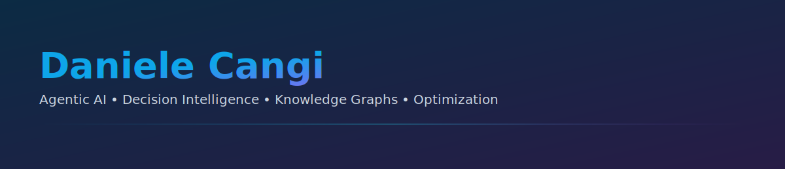

  

# Daniele Cangi

Designing and building intelligent systems at the intersection of agentic AI, decision intelligence, and graph-based knowledge. I focus on compositional reasoning, orchestration, and optimization (including quantum‑inspired methods), translating research into production-grade tools and workflows.

## Featured work
div align="center">
  
  

  
  

  
  

## Tech stack
div align="center">
  
  
  
  
  
  
  
  

## Focus areas
- Agentic AI and LLM orchestration
- Decision engines and programmatic reasoning
- Knowledge graphs and graph-based learning
- Optimization and quantum‑inspired methods
- Spatiotemporal and 4D modeling
- Engineering: Python, TypeScript, GitHub Actions, MkDocs/Docusaurus

## Active projects
- Reson-AI — Agentic AI framework for compositional reasoning and decision support
- Argos Decision Engine — Decision intelligence engine and tooling
- AstroMind-4D — Cognitive modeling for spatiotemporal systems
- Quantum-Felix — Hybrid and quantum‑inspired research tooling
- AIpowerCoin — Advanced system with public documentation and collaboration portal

## Status & metrics

  
  

## Collaboration
- Open to co‑development, benchmarking, integrations, and applied research
- Contact: open an issue on any repository or DM on GitHub