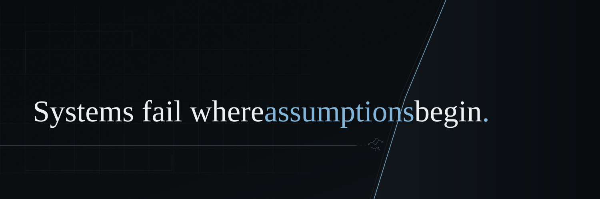

  

**Independent Systems Researcher & Builder**

**Build → Measure → Attack assumptions → Verify → Restrict claims → Harden**

## Current work

### [XCP Studio](https://xcpstudio.com)

An experimental source-to-target adaptation system using Xbox Series X as a real constrained execution target.

XCP began as a deterministic compute worker and evolved into a broader system for source observation, Typed Semantic IR, constrained target execution, differential analysis, causal attribution and evidence-bound equivalence.

Development is currently private; selected research artifacts and reproducible evidence may be released separately.

### [WorldLoop](https://worldloop.io)

A procedural CAD and world-generation system for Roblox.

WorldLoop evolved from an architecture generator into a CAD-first system for creating editable buildings, terrain and procedural environments, with deterministic delivery into Roblox Studio.

## Other product work

**Co-author — [LLegal](https://llegal.unityloop.ai/)**

Legal evidence and state infrastructure built around Danish legal sources, combining authority-aware retrieval, temporal validity, document analysis and provenance.

**Co-author — [Roomee](https://www.roomee.dk/)**

A Denmark-focused roommate and room-matching platform with server-authoritative matching, privacy controls and mobile product infrastructure.

## The common thread

The domains change, but the method is consistent: build the system, observe where the model stops matching reality, make the assumptions explicit, strengthen the evidence, and change the architecture when necessary.

Some projects are developed independently and others through [UnityLoop](https://www.unityloop.ai/).

[Hugging Face](https://huggingface.co/Nexus-Walker) · [LinkedIn](https://www.linkedin.com/in/daniele-cangi/)

---

  

